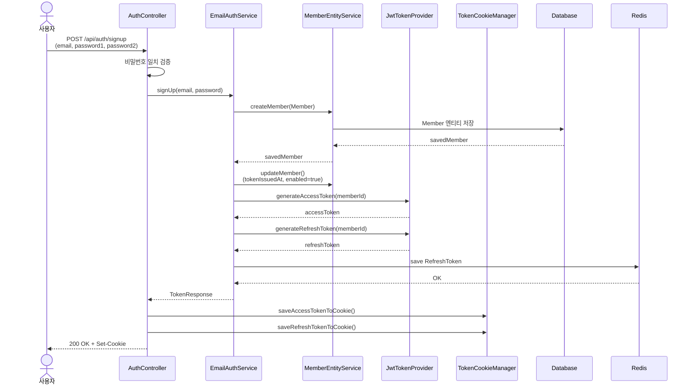
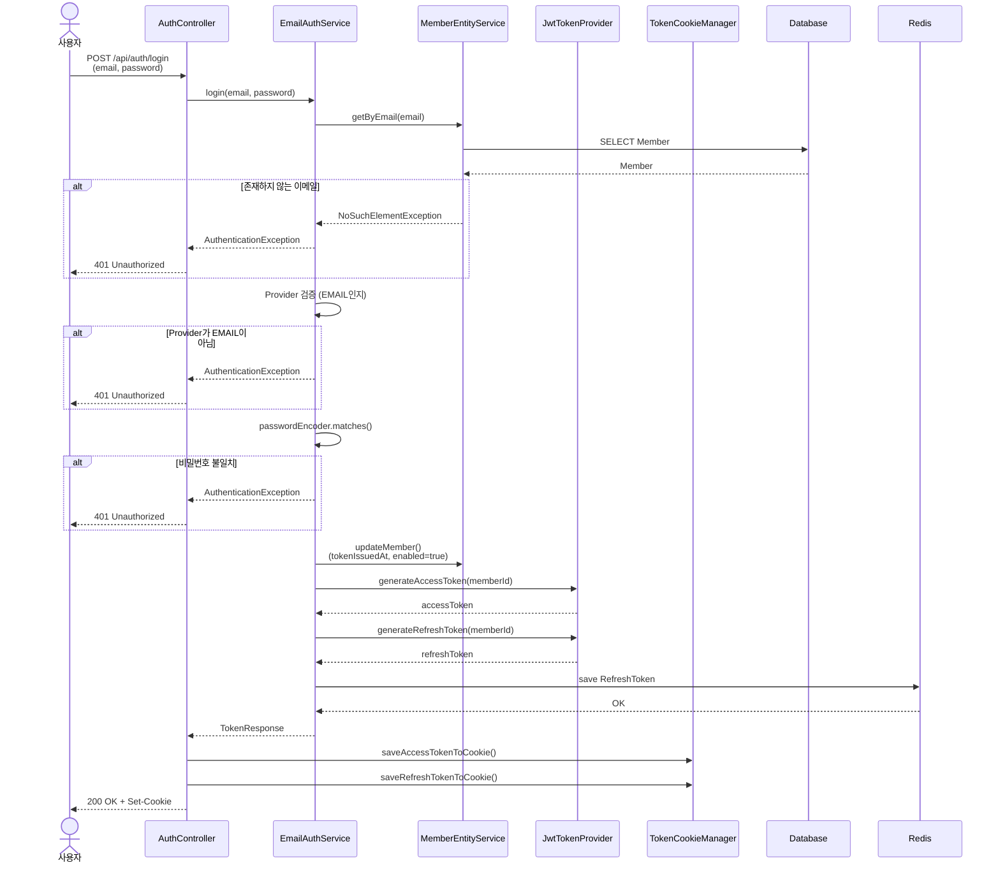
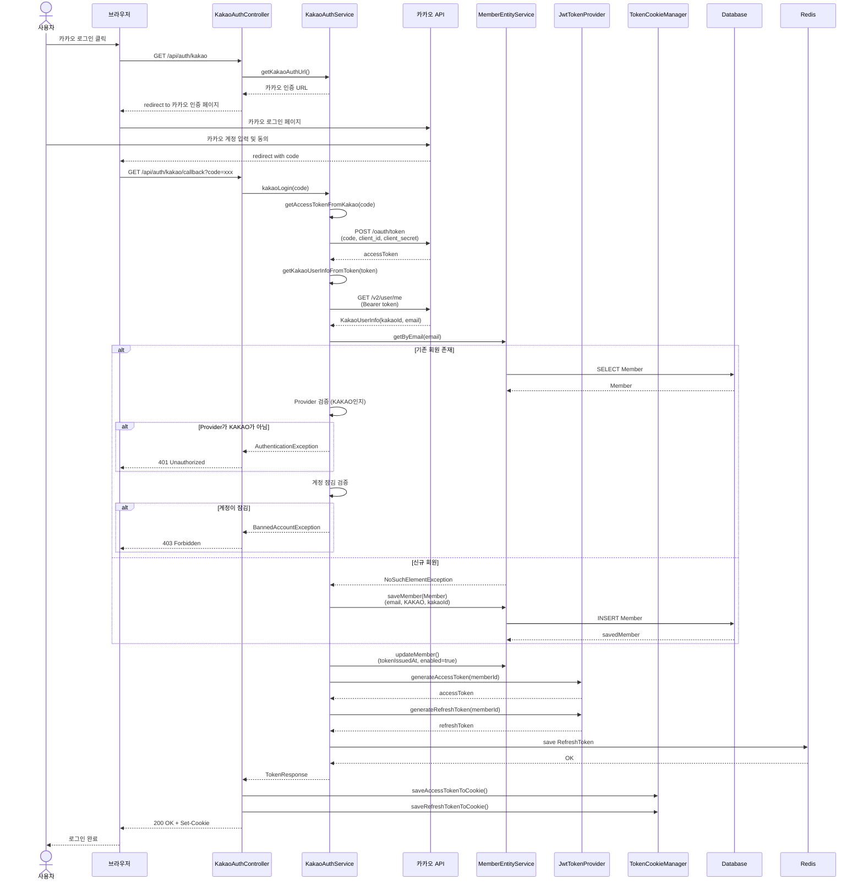
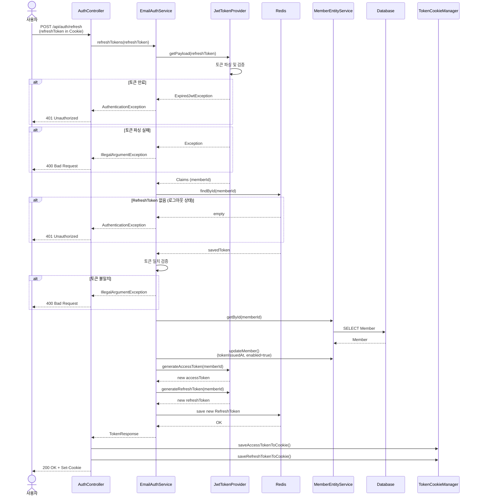

# 로그인/회원가입 플로우

## 1. 이메일 회원가입 및 로그인

### 회원가입 시퀀스

### 로그인 시퀀스

---

## 2. 카카오 OAuth 로그인

### 카카오 로그인 전체 플로우

---

## 3. 토큰 갱신 플로우

---

## 핵심 컴포넌트 설명

### AuthController

- 인증 관련 HTTP 요청 처리
- 회원가입, 로그인, 토큰 갱신 엔드포인트 제공

### EmailAuthService

- 이메일 기반 인증 비즈니스 로직
- 비밀번호 검증, 토큰 발급 처리

### KakaoAuthService

- 카카오 OAuth 2.0 인증 처리
- 카카오 API와 통신하여 사용자 정보 조회
- 기존 회원 확인 또는 신규 회원 생성

### JwtTokenProvider

- JWT 토큰 생성 및 검증
- Access Token (짧은 유효기간)
- Refresh Token (긴 유효기간)

### TokenCookieManager

- 토큰을 HTTP 쿠키에 저장
- HttpOnly, Secure 속성 설정

### MemberEntityService

- Member 엔티티 CRUD 처리
- 회원 조회, 생성, 수정

### Redis

- Refresh Token 저장소
- 로그아웃 시 삭제하여 토큰 무효화
