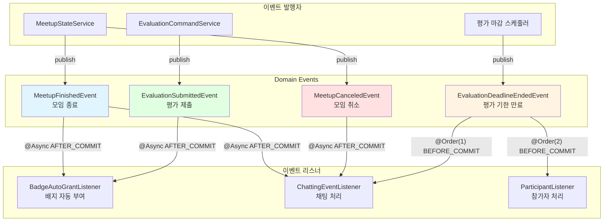
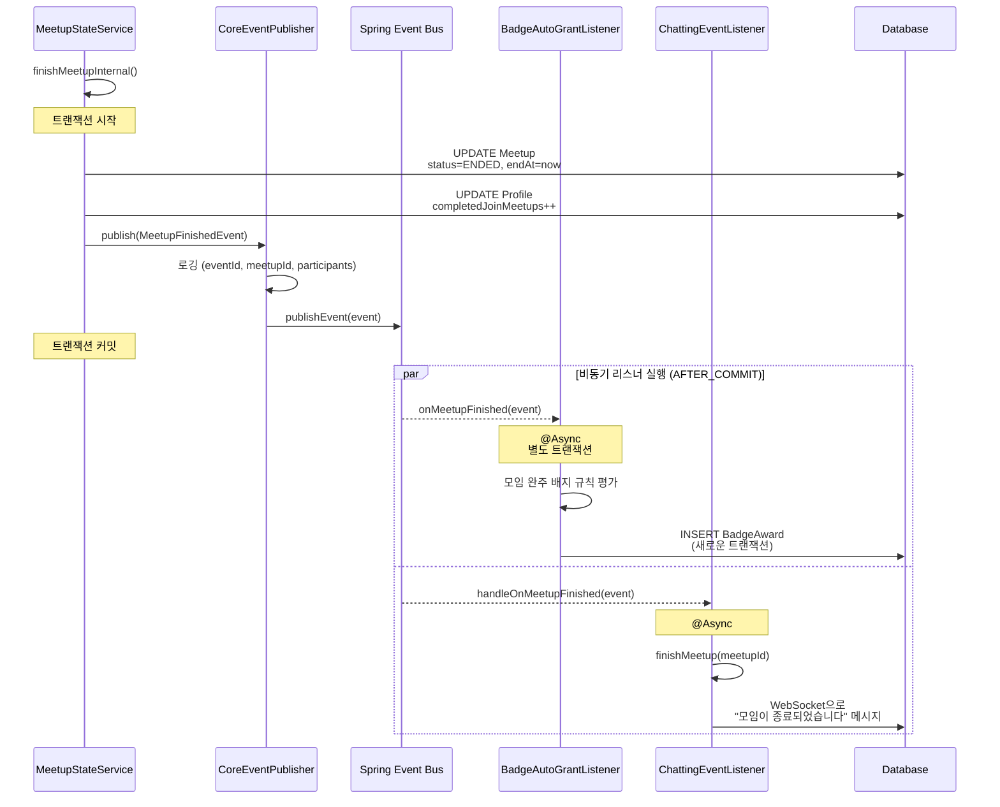
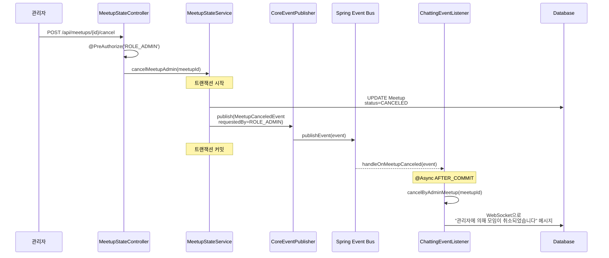
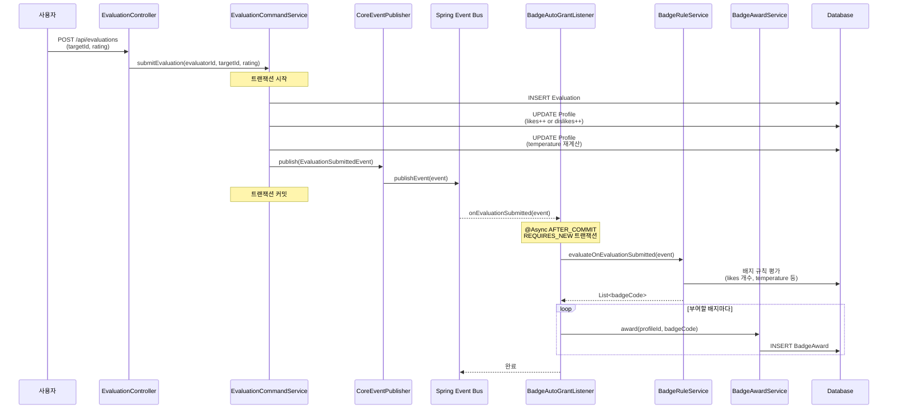
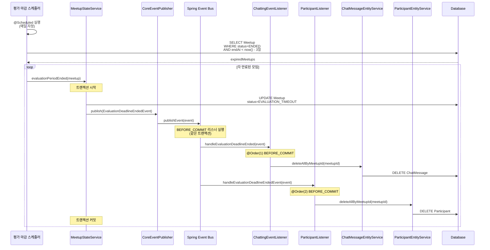
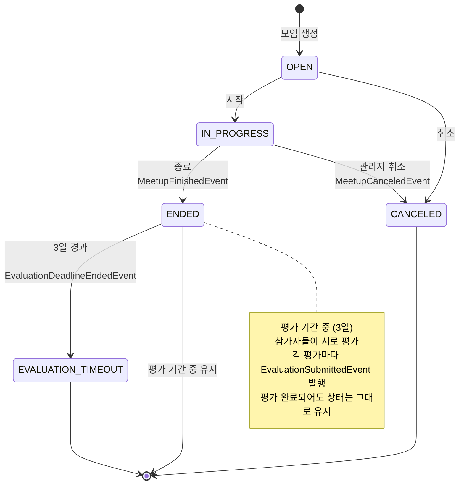
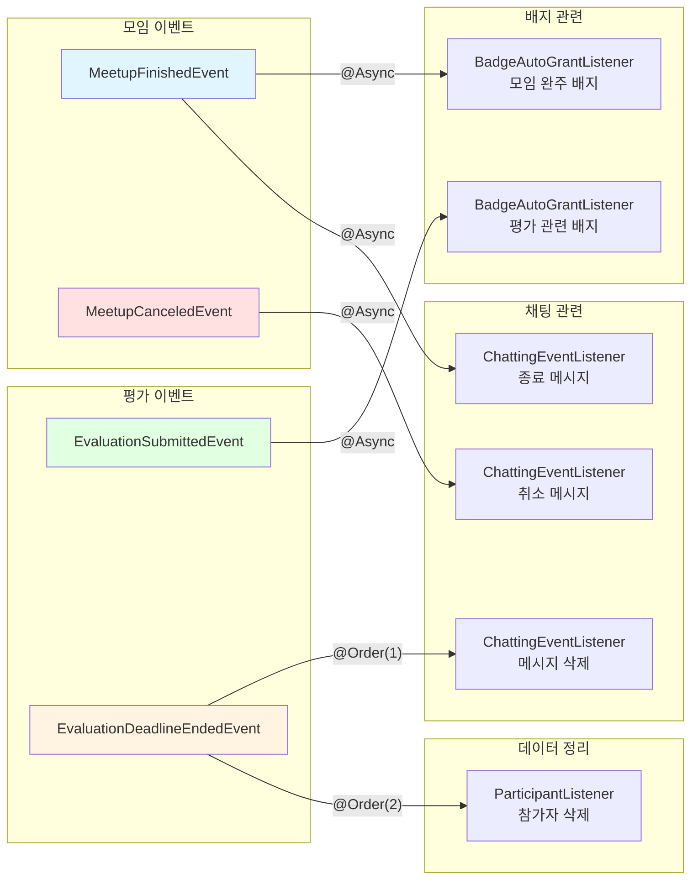

# 이벤트 아키텍처

## 1. 전체 이벤트 구조 개요



---

## 2. 이벤트 상세 설명

### 2.1 MeetupFinishedEvent (모임 종료)

**발행 시점**: 모임 소유자가 모임을 종료할 때



**이벤트 데이터**:

```java
class MeetupFinishedEvent {
    UUID eventId;              // 이벤트 고유 ID
    LocalDateTime occurredAt;  // 발생 시각
    UUID meetupId;             // 종료된 모임 ID
    List<UUID> participantProfileIds;  // 참가자 프로필 ID 목록
}
```

**리스너 처리**:

| 리스너                 | 처리 내용                | 트랜잭션     | 비동기 |
| ---------------------- | ------------------------ | ------------ | ------ |
| BadgeAutoGrantListener | 모임 완주 관련 배지 부여 | REQUIRES_NEW | ✅     |
| ChattingEventListener  | 채팅방 종료 메시지 발송  | 별도         | ✅     |

---

### 2.2 MeetupCanceledEvent (모임 취소)

**발행 시점**: 관리자가 모임을 취소할 때 (사용자 취소는 이벤트 발행 없음)



**이벤트 데이터**:

```java
class MeetupCanceledEvent {
    UUID eventId;
    LocalDateTime occurredAt;
    UUID meetupId;             // 취소된 모임 ID
    Role requestedBy;          // ROLE_ADMIN (관리자만 발행)
}
```

**리스너 처리**:

| 리스너                | 처리 내용                        | 트랜잭션 | 비동기 |
| --------------------- | -------------------------------- | -------- | ------ |
| ChattingEventListener | 채팅방에 관리자 취소 메시지 발송 | 별도     | ✅     |

---

### 2.3 EvaluationSubmittedEvent (평가 제출)

**발행 시점**: 참가자가 다른 참가자를 평가할 때



**이벤트 데이터**:

```java
class EvaluationSubmittedEvent {
    UUID eventId;
    LocalDateTime occurredAt;
    UUID meetupId;             // 평가 대상 모임 ID
    UUID evaluatorProfileId;   // 평가자 프로필 ID
    UUID targetProfileId;      // 평가 받는 사람 프로필 ID
    Rating rating;             // LIKE or DISLIKE
}
```

**리스너 처리**:

| 리스너                 | 처리 내용                                           | 트랜잭션     | 비동기 |
| ---------------------- | --------------------------------------------------- | ------------ | ------ |
| BadgeAutoGrantListener | 평가 관련 배지 자동 부여 (좋아요 N개, 온도 달성 등) | REQUIRES_NEW | ✅     |

---

### 2.4 EvaluationDeadlineEndedEvent (평가 기한 만료)

**발행 시점**: 스케줄러가 평가 기한이 지난 모임을 감지할 때



**이벤트 데이터**:

```java
class EvaluationDeadlineEndedEvent {
    UUID eventId;
    LocalDateTime occurredAt;
    UUID meetupId;             // 평가 기한이 만료된 모임 ID
}
```

**리스너 처리**:

| 리스너                | 처리 내용               | 순서      | 트랜잭션                      | 비동기 |
| --------------------- | ----------------------- | --------- | ----------------------------- | ------ |
| ChattingEventListener | 채팅 메시지 모두 삭제   | @Order(1) | BEFORE_COMMIT (같은 트랜잭션) | ❌     |
| ParticipantListener   | 참가자 데이터 모두 삭제 | @Order(2) | BEFORE_COMMIT (같은 트랜잭션) | ❌     |

**주의사항**:

- `BEFORE_COMMIT`으로 같은 트랜잭션에서 실행됨
- `@Order`로 실행 순서 보장 (채팅 메시지 먼저, 참가자는 나중)
- 하나라도 실패하면 전체 롤백

---

## 3. 이벤트 흐름 전체 매핑

### 3.1 모임 생명주기와 이벤트



### 3.2 이벤트별 리스너 매핑



---

## 4. 트랜잭션

| 이벤트                       | 리스너                 | 트랜잭션 단계 | 이유                                           |
| ---------------------------- | ---------------------- | ------------- | ---------------------------------------------- |
| MeetupFinishedEvent          | BadgeAutoGrantListener | AFTER_COMMIT  | 배지 부여 실패해도 모임 종료는 완료되어야 함   |
| MeetupFinishedEvent          | ChattingEventListener  | AFTER_COMMIT  | 메시지 발송 실패해도 모임 종료는 완료되어야 함 |
| MeetupCanceledEvent          | ChattingEventListener  | AFTER_COMMIT  | 메시지 발송 실패해도 취소는 완료되어야 함      |
| EvaluationSubmittedEvent     | BadgeAutoGrantListener | AFTER_COMMIT  | 배지 부여 실패해도 평가는 저장되어야 함        |
| EvaluationDeadlineEndedEvent | ChattingEventListener  | BEFORE_COMMIT | 데이터 삭제는 원자적으로 처리되어야 함         |
| EvaluationDeadlineEndedEvent | ParticipantListener    | BEFORE_COMMIT | 데이터 삭제는 원자적으로 처리되어야 함         |
