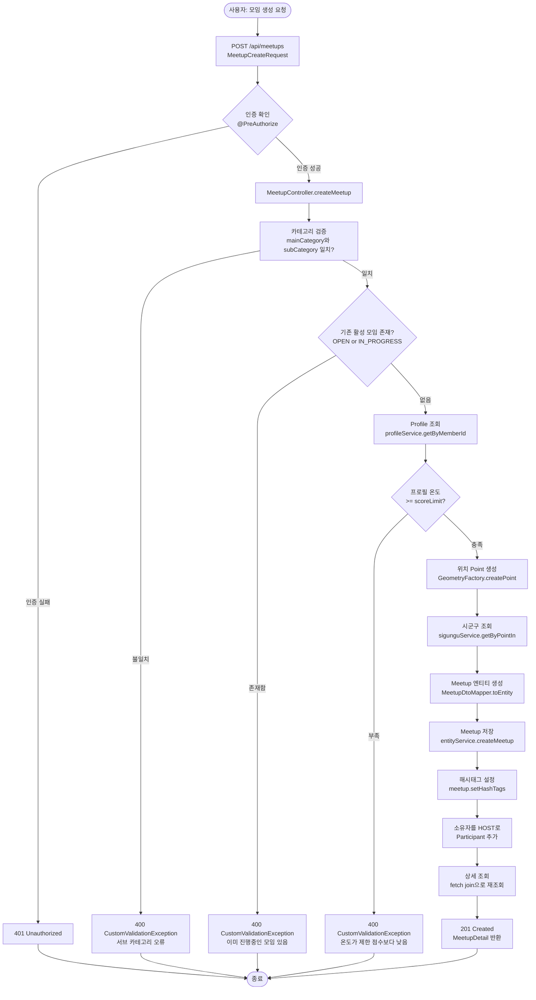
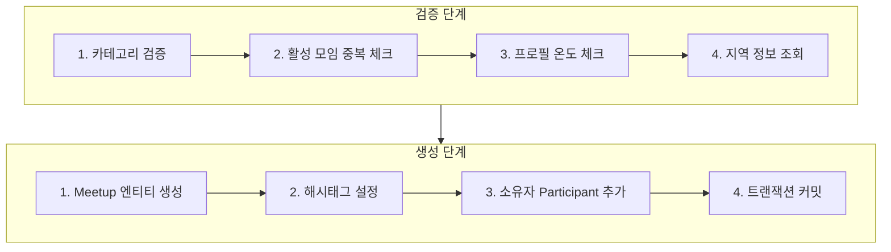
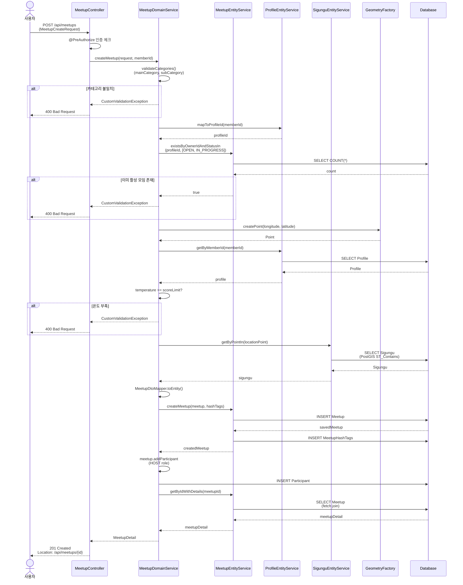
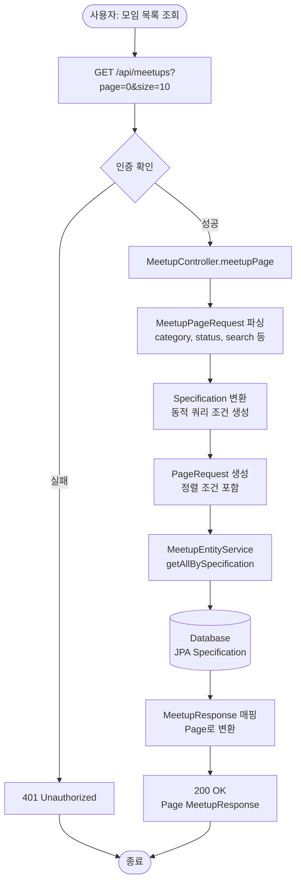
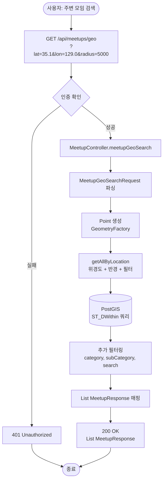
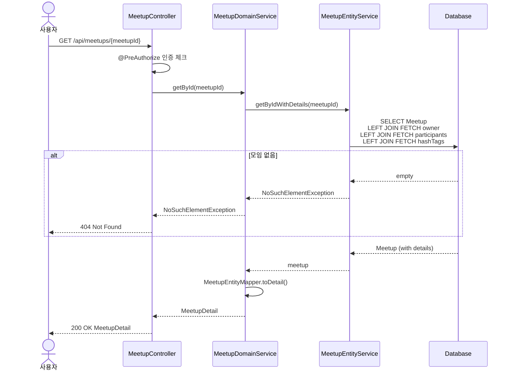
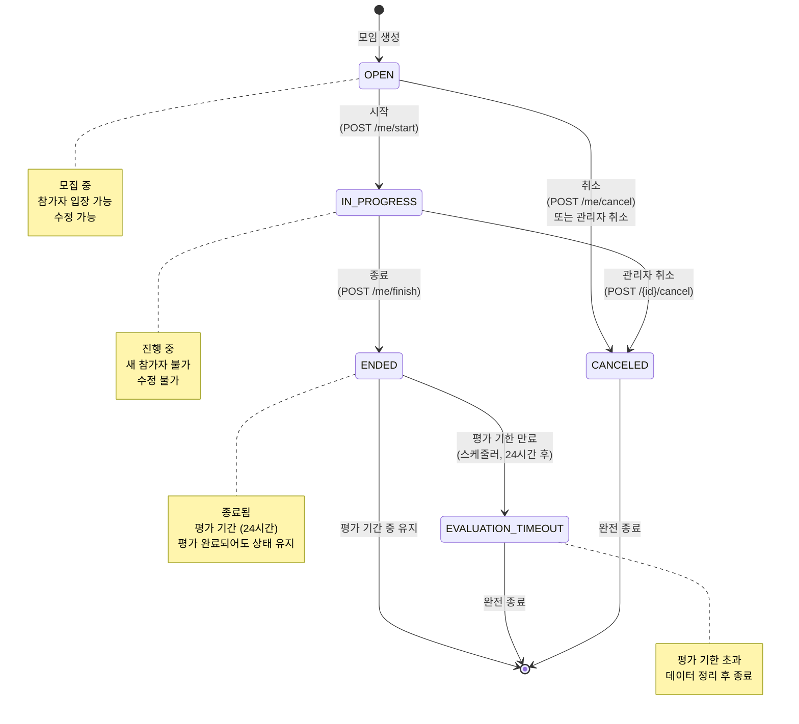
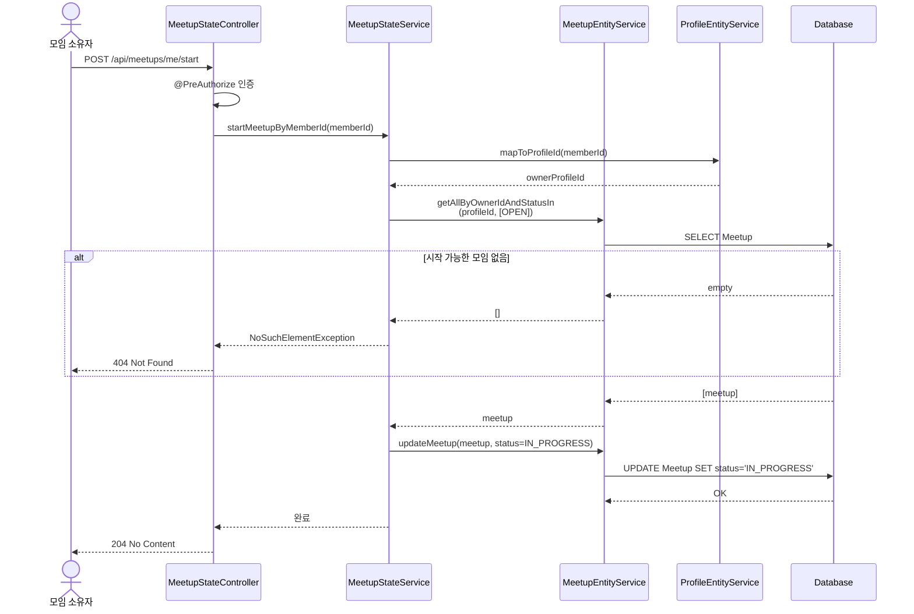
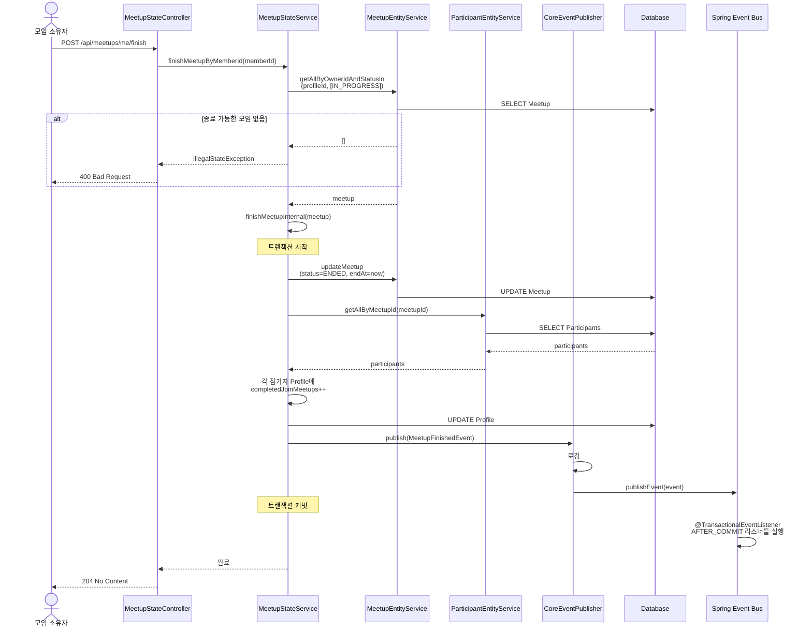
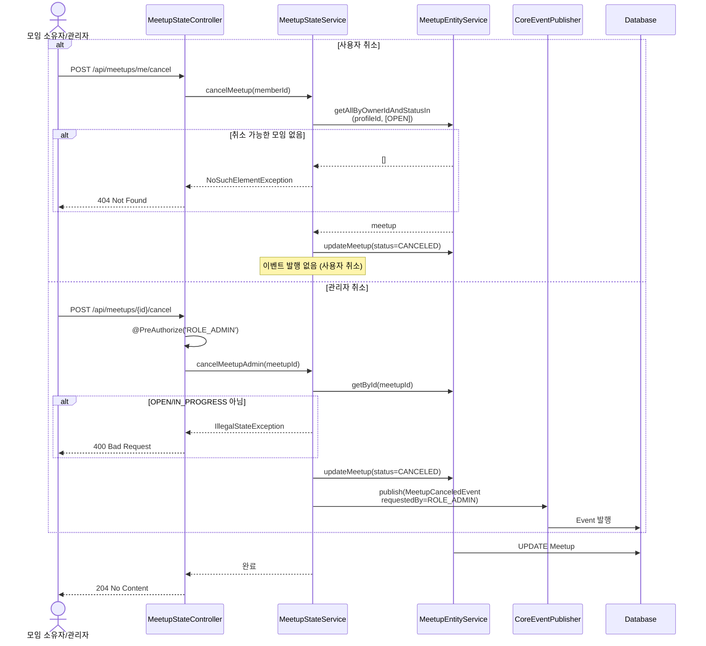

# 모임 생성/조회/삭제 플로우

## 1. 모임 생성 플로우차트

### 전체 프로세스

### 상세 검증 로직

---

## 2. 모임 생성 시퀀스 다이어그램

---

## 3. 모임 조회 플로우

### 페이지네이션 조회

### 지역 기반 조회 (PostGIS)

### 상세 조회

---

## 4. 모임 상태 전이 다이어그램

---

## 5. 모임 상태 변경 시퀀스

### 모임 시작

### 모임 종료 (이벤트 발행)

### 모임 취소

---

## 핵심 컴포넌트 설명

### MeetupController

- 모임 CRUD HTTP 요청 처리
- 페이지네이션, 지역 검색, 상세 조회 엔드포인트

### MeetupStateController

- 모임 상태 변경 전용 컨트롤러
- 시작, 종료, 취소 엔드포인트

### MeetupDomainService

- 모임 생성/조회/수정 비즈니스 로직
- 복잡한 검증 로직 처리
- DTO ↔ Entity 변환

### MeetupStateService

- 모임 상태 전이 비즈니스 로직
- 이벤트 발행 책임
- 트랜잭션 관리

### MeetupEntityService

- Meetup 엔티티 CRUD
- 데이터베이스 직접 접근
- 단순 쿼리 처리

### GeometryFactory

- JTS (Java Topology Suite)
- 위경도를 Point 객체로 변환
- PostGIS와 호환

### PostGIS

- PostgreSQL 공간 확장
- `ST_Contains`: 점이 영역 내에 있는지
- `ST_DWithin`: 두 지점 간 거리 계산

### CoreEventPublisher

- Spring Event 발행 래퍼
- 로깅 추가
- DomainEvent 전파
